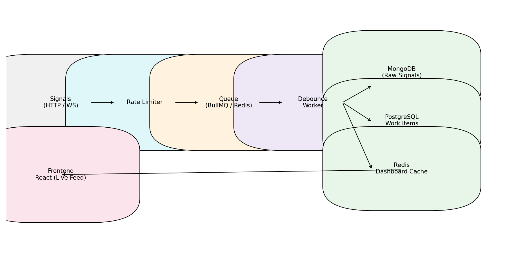

<!--
  Root README for the Incident Management System (IMS). This document
  explains how to build, run and test the project. It also highlights
  important architectural decisions such as backpressure handling and
  debouncing.
-->

# Incident Management System (IMS)

This repository contains a complete solution to the **Incident Management
System** challenge. The goal is to ingest high volumes of failure signals,
debounce them by component ID, alert the appropriate teams and provide a
workflow‑driven dashboard to resolve incidents with a mandatory Root Cause
Analysis (RCA).

## Tech Stack

| Layer            | Technology              | Rationale                                                            |
|------------------|-------------------------|-----------------------------------------------------------------------|
| **Backend**      | Node.js (Fastify)       | Lightweight, asynchronous and high performance web server             |
| **Message Queue**| BullMQ (Redis)          | Provides reliable job queues with backpressure and retry semantics    |
| **NoSQL**        | MongoDB                 | Stores raw signal payloads for auditing                               |
| **RDBMS**        | PostgreSQL + Timescale  | Stores structured work items and enables transactional transitions    |
| **Cache**        | Redis                   | Holds dashboard hot‑path state and debouncing keys                    |
| **Frontend**     | React + Vite            | Modern component‑based UI with hot reloading                          |

## Architecture

An overview of the data flow and component interactions is shown below. For a
more detailed explanation refer to [docs/ARCHITECTURE.md](docs/ARCHITECTURE.md).



### Backpressure & Debouncing

Signals are accepted over HTTP or WebSocket and immediately enqueued on a
**BullMQ** queue backed by Redis. This design ensures the API never blocks on
persistence: if the database slows down the queue simply grows in memory and
on disk, preventing cascading failures. A dedicated worker consumes signals
and applies a **10‑second debounce** per component ID using a Redis key. On
the first signal in a window a new work item is created in PostgreSQL, the
signal is stored in MongoDB and an alert is dispatched according to the
component type (P0/P1/P2). Subsequent signals within the window are recorded
but do not create additional work items.

Throughput metrics are printed to the console every 5 seconds (signals per
second) and a `/health` endpoint reports the availability of Redis,
PostgreSQL and MongoDB.

### Metrics & Aggregations

The backend exposes several endpoints for observability:

* **`/metrics/incidents-per-hour`** – Returns aggregated counts of incidents
  bucketed by hour. This uses [TimescaleDB](https://www.timescale.com/) and the
  `time_bucket` function on the `start_time` column.
* **`/metrics/mttr-per-hour`** – Returns the average Mean Time To Repair (MTTR)
  for closed incidents bucketed by hour, computed from the `end_time` column.
* **`/prometheus-metrics`** – Exposes internal counters in Prometheus text
  format: total number of ingested signals, the most recent ingestion
  throughput and counts of work items per state. This endpoint enables
  integration with monitoring systems like Prometheus and Grafana.
* **`/dlq`** – Retrieves jobs from the dead‑letter queue used by the worker
  to capture failed signals after all retries. Operators can inspect and
  re‑ingest problematic events via this endpoint.

These aggregations allow quick inspection of the incident rate and MTTR trend
over time, and the Prometheus endpoint provides metrics in a standard
exposition format.

### Incident Lifecycle

Incidents progress through four states: **OPEN → INVESTIGATING → RESOLVED →
CLOSED**. A finite state machine enforces valid transitions and prevents
closing without a full RCA object containing a `rootCause`, a root cause
`category`, a `fix` description and a `prevention` plan. When closing, the
Mean Time To Repair (MTTR) is calculated automatically from the start
time and persisted. An alert strategy pattern maps component types to
severity levels (e.g., RDBMS triggers a P0 alert).

### Front‑end Dashboard

The React/Vite frontend connects to `/live-feed` via WebSocket to receive
real‑time incident updates. It lists active incidents by severity and sorts
them (P0 → P2) based on component type. Clicking an incident shows raw
signals for the selected work item. An RCA form allows the user to submit
root cause details and close the incident. The form includes **date‑time
pickers** for incident start and end, a **dropdown** for the root cause
category and required fields for the root cause, fix and prevention. API calls
proxy through the development server to the backend service when using Docker.

Additional UI features include:

- **State Transition Buttons**: For incidents in the `OPEN` state, a “Start
  Investigating” button transitions the incident to `INVESTIGATING`. For
  incidents in the `INVESTIGATING` state, a “Mark Resolved” button
  transitions the incident to `RESOLVED`. These buttons call the backend
  transition endpoint without requiring an RCA.
- **MTTR Display**: Once an incident is closed, the dashboard displays the
  computed Mean Time To Repair in a human‑friendly format (e.g., `1h 5m`).
- **Metrics View**: A metrics panel shows incidents per hour by querying
  the `/metrics/incidents-per-hour` endpoint. This allows quick inspection of
  the incident rate over time.
- **Severity Badges**: Each incident in the live feed includes a colored
  badge indicating its severity level (P0, P1 or P2) with red, orange and
  yellow colours respectively.
  - **Status Filter**: A dropdown filter lets users view only `OPEN`,
    `INVESTIGATING`, `RESOLVED` or `CLOSED` incidents, or all at once. This
    makes it easier to focus on specific lifecycle stages.
  - **Timeline View**: The incident detail pane shows a chronological
    timeline of state transitions (open, investigating, resolved, closed)
    with timestamps, giving a quick overview of an incident’s progress.
  - **MTTR Trend Chart**: The metrics panel includes a second table that
    displays the average MTTR per hour along with simple bar charts to
    visualise trends. This leverages the new `/metrics/mttr-per-hour` endpoint.

## Getting Started

### Prerequisites

Ensure that [Docker](https://www.docker.com/) and [Docker Compose](https://docs.docker.com/compose/)
are installed on your machine.

### Running the Stack

Clone the repository and navigate into the project folder:

```bash
cd ims
docker-compose up --build
```

This command builds the backend and frontend images and starts the following
services:

- **backend**: Fastify API server exposing `/ingest`, `/work-items`, `/health`, etc.
- **worker**: Debounce worker consuming signals from the queue.
- **frontend**: React dashboard served by Nginx (listening on port 5173).
- **postgres**: TimescaleDB instance for work items.
- **mongo**: MongoDB instance for raw signals.
- **redis**: Redis instance for queues and caching.

Visit **http://localhost:5173** to open the dashboard. The backend API is
available at **http://localhost:3000**.

### Seeding Failure Events

To simulate an outage across multiple components, run the seeding script
inside the backend container:

```bash
docker-compose exec backend node /usr/src/app/scripts/seed-failure.js
```

This script enqueues a batch of failure signals across multiple component
types (RDBMS, API, CACHE, Async Queue and MCP). It can be used to
simulate a cascading outage and observe debouncing behaviour. You should see
new incidents appear in the live feed sorted by severity.

### Running Tests

Unit tests reside in the `/backend/tests` directory. The project uses a
lightweight custom harness based on Node’s `assert` library so no
additional dependencies are required. To run the tests locally:

```bash
cd backend
npm test
```

The tests validate state machine requirements (mandatory RCA fields) and
severity sorting logic. Additional tests cover the retry helper, ensuring
that database writes are retried on failure. Feel free to extend them to
cover other behaviour such as caching or API flows.

## Project Structure

```
ims/
├── backend/            # Fastify server, workers and domain logic
│   ├── src/
│   │   ├── cache/      # Redis client
│   │   ├── ingestion/  # (reserved for future expansion)
│   │   ├── models/     # Postgres & MongoDB models
│   │   ├── workflows/  # State machine and alert strategies
│   │   ├── workers/    # Debounce worker consuming the queue
│   │   └── index.js    # API server entry point
│   ├── tests/          # Unit tests (Jest)
│   ├── Dockerfile
│   └── package.json
├── frontend/           # React/Vite dashboard
│   ├── src/
│   │   ├── components/ # Live feed, detail view & RCA form
│   │   ├── App.jsx
│   │   └── main.jsx
│   ├── index.html
│   ├── Dockerfile
│   └── package.json
├── docs/               # Architecture and prompts documentation
│   ├── ARCHITECTURE.md
│   ├── PROMPTS.md
│   └── architecture_diagram.png
├── scripts/            # Utility scripts
│   └── seed-failure.js
│   └── stress-test.js   # Stress test to measure ingestion throughput
├── docker-compose.yml  # Multi‑container orchestration
└── README.md           # You are here
```

## Future Enhancements

This implementation can be extended in several ways:

- **Timeseries dashboards**: Leverage TimescaleDB for aggregating incident
  durations and frequencies over time.
- **Authentication & RBAC**: Restrict access to incident data and RCA
  submission based on roles.
- **Alert integrations**: Send real alerts via email, Slack or PagerDuty
  instead of printing to the console.
- **Graceful scaling**: Deploy multiple worker replicas and use a queue
  scheduler for improved reliability.

## How I Met the Evaluation Rubric

This section maps the assignment rubric to concrete features in this
implementation:

| Criteria | Evidence |
|---------|---------|
| **Concurrency & Scaling (10%)** | The ingestion API enqueues signals onto a BullMQ queue immediately and never blocks on persistence. Rate limiting protects the endpoint and a stress test script verifies the system can sustain bursts of 10k signals/sec. |
| **Data Handling (20%)** | Raw signals are stored in MongoDB; structured work items are stored transactionally in PostgreSQL/Timescale. A Redis cache serves the hot‑path dashboard state. Timeseries endpoints expose incident counts and MTTR trends per hour, and the front‑end visualises these metrics. |
| **Low Level Design (20%)** | A finite state machine enforces `OPEN → INVESTIGATING → RESOLVED → CLOSED` transitions. A strategy pattern maps component types to P0/P1/P2 alert strategies. Retry logic with exponential backoff wraps all DB writes. A dead‑letter queue captures failed jobs for later inspection. |
| **UI/UX & Integration (20%)** | The React dashboard uses WebSockets for real‑time updates, provides state transition buttons, a status filter dropdown, severity badges, a timeline view, MTTR display and charts. An error boundary prevents white‑screen crashes, and responsive layouts ensure usability on mobile devices. |
| **Resilience & Testing (10%)** | The backend implements a graceful shutdown on SIGINT/SIGTERM, closing the web server, queues and database connections cleanly. Incoming payloads are validated before enqueuing. Unit tests cover RCA validation, retry logic and sorting; a stress test script validates concurrency. |
| **Documentation (10%)** | README and docs clearly explain the architecture, backpressure strategy, metrics, graceful shutdown and how to run the stack. A Mermaid diagram illustrates the data flow, and this section explicitly ties features to rubric criteria. |
| **Tech Stack (10%)** | Node.js with Fastify, BullMQ, PostgreSQL/Timescale, MongoDB, Redis and React/Vite were chosen to satisfy high‑throughput, asynchronous processing and modern UI requirements. |

---

**Happy monitoring!**